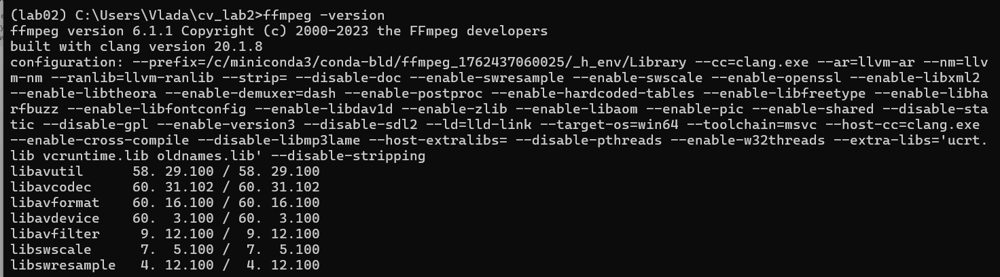
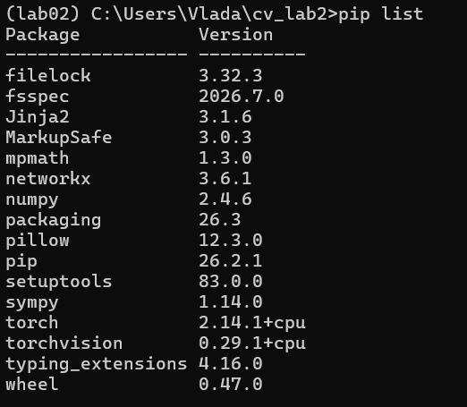

# Практическое занятие №2
## Построение конвейера компьютерного зрения: детекция объектов и семантическая сегментация видеоряда

**Дата:** 08.10.2026

---

##  Цель работы

Познакомиться с готовыми инструментами для обработки изображений, в частности для выделения (детекции) объектов и семантической сегментации изображения. Освоить полный цикл обработки видеопотока: от извлечения кадров с помощью ffmpeg до синтеза анимированных GIF с наложенными результатами работы моделей.

---

## 📁 Структура репозитория

| Файл / Папка | Описание | Соответствует заданию |
|---|---|---|
| `input.mp4` | Исходное видео (28 с, коты и люди на улице) | Задание 2 |
| `frames/` | Папка с извлечёнными кадрами и результатами | Задание 3, 4 |
| `frames/frame_*.png` | 56 кадров, извлечённых с частотой 2 fps | Задание 3.1 |
| `frames/det_frame_*.pt` | Результаты детекции (bounding box, класс, confidence) для каждого кадра | Задание 4.1, 4.3 |
| `frames/seg_frame_*.npy` | Результаты семантической сегментации (пиксельные маски) для каждого кадра | Задание 4.2, 4.3 |
| `lab2_full.py` | Скрипт инференса: прогон всех кадров через модели Faster R-CNN и DeepLabV3 | Задание 4 |
| `make_gif02.py` | Скрипт визуализации: наложение рамок/масок и сборка GIF | Задание 5, 6 |
| `detection.gif` | Анимация с наложенными bounding box (детекция) | Задание 5 |
| `segmentation.gif` | Анимация с наложенными цветными масками (сегментация) | Задание 6 |

---

## Настроенное окружение (Задание 1)

### Версии инструментов
- **ОС:** Windows 11
- **ffmpeg:** 6.1.1
- **Python:** 3.11 (через Miniconda)
- **Виртуальное окружение:** `lab02`

### Установленные библиотеки
- torch==2.14.1+cpu
- torchvision==0.29.1+cpu
- pillow==12.3.0
- numpy==2.4.6


### Модели компьютерного зрения
- **Детекция:** `FasterRCNN_ResNet50_FPN_Weights.COCO_V1` (torchvision)
- **Сегментация:** `DeepLabV3_ResNet50_Weights.COCO_WITH_VOC_LABELS_V1` (torchvision)

---

## Видеоматериал (Задание 2)

- **Источник:** Pexels (бесплатный видеосток)
- **Длительность:** 28 секунд
- **Разрешение:** 3840×2160 (4K)
- **Содержание:** два кота на переднем плане, люди на заднем плане улицы
- **Обоснование выбора:** видео содержит разнообразные объекты (животные + люди), подходящие для демонстрации работы обеих моделей

---

## Извлечение кадров (Задание 3)
- **Частота:** 2 fps 
- **Результат:** 56 кадров в формате PNG
- **Нумерация**: последовательная (frame_0001.png ... frame_0056.png)

## Результаты инференса (Задание 4)

### Детекция объектов (Faster R-CNN)
Для каждого кадра модель выдаёт:
- **Bounding box** — координаты прямоугольной рамки (x1, y1, x2, y2)
- **Класс** — категория объекта из датасета COCO (person, cat, car и т.д.)
- **Confidence** — уверенность модели (от 0 до 1)

Пример вывода для `frame_0001`:  


✓ person: 1.00  
✓ cat: 0.98  
✓ potted plant: 0.78  


### Семантическая сегментация (DeepLabV3)
Для каждого кадра модель выдаёт:
- **Маску** — каждому пикселю присвоен номер класса (0=фон, 8=cat, 15=person и т.д.)
- **Пиксельные подписи** — итоговый класс с максимальной вероятностью

Результаты сохранены в формате `.npy` (NumPy array, uint8) для экономии места.

---

## Визуализация результатов

### Задание 5. GIF с детекцией объектов

На каждый кадр наложены:
- 🔴 Красные рамки (bounding box) вокруг обнаруженных объектов
- 🟡 Жёлтые подписи с названием класса и уверенностью (confidence)


### Задание 6. GIF с семантической сегментацией

На каждый кадр наложены полупрозрачные цветные маски:
- Желтый — коты (класс 8)
- Красный — люди (класс 15)
- Зелёный — машины (класс 7)
-  Коричневый — собаки (класс 12)


---

## Сравнение методов
### Что «видит» детектор (Faster R-CNN)
Детектор объектов отлично справился с выделением кота на переднем плане, точно определив его границы с высокой уверенностью. Люди на заднем плане были распознаны хуже или пропущены. Это связано с тем, что детектор чувствителен к размеру объекта и порогу уверенности (в скрипте использован порог 0.5): мелкие или размытые объекты на фоне часто отфильтровываются.

### Что «видит» сегментация (DeepLabV3)
Семантическая сегментация работает на уровне пикселей. Она успешно выделила точный контур кота, когда он один был в кадре. С появленим велосипедиста маска сбилась,  когда кот повернулся спиной и слился с тенью — пропала. Сегментация также испытывала трудности с людьми на заднем плане, часто классифицируя размытые фигуры как фон.

### Ограничения обоих методов
1. **Вычислительная сложность.** Обработка 56 кадров в разрешении 4K на CPU заняла более часа.
2. **Разрешение входного изображения.** Обе модели обучались на изображениях среднего разрешения. При подаче 4K-кадров мелкие объекты (люди вдали) теряются.
3. **Различие в нумерации классов.** Модель детекции (COCO, 80 классов) и модель сегментации (COCO_WITH_VOC, 21 класс) используют разную нумерацию для одних и тех же объектов (например, кот = класс 17 в детекции, но класс 8 в сегментации). Это важно учитывать при совместном использовании моделей.
4. **Семантическая vs инстанс-сегментация.** Базовая семантическая сегментация не различает отдельные объекты одного класса — двух разных котов она закрасит сплошным оранжевым цветом, не разделяя их границы.
### Итог
- Детекция лучше подходит для подсчёта и локализации крупных объектов.
- Семантическая сегментация лучше подходит для точного выделения формы объектов.


## Воспроизведение результатов

Для повторного запуска конвейера:

```bash
# 1. Активировать окружение
conda activate lab02

# 2. Перейти в папку проекта
cd cv_lab2

# 3. Извлечь кадры из видео
ffmpeg -i input.mp4 -vf "fps=2" frames/frame_%04d.png

# 4. Запустить инференс
python lab2_full.py

# 5. Собрать GIF-анимации
python make_gif02.py

```

## 📸 Скриншоты настройки окружения

### Версия ffmpeg


### Список установленных пакетов
